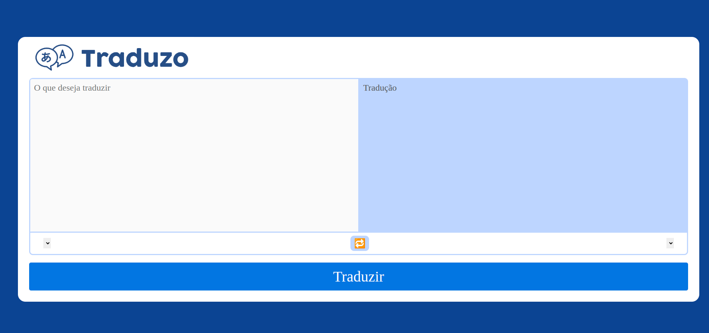

# Bem vindo(a) ao repositório do projeto Traduzo!

 

> Neste projeto foi desenvolvido uma ferramenta de tradução de textos entre vários idiomas, utilizando Python com o Framework Flask, para criar uma aplicação Server Side. Ou seja, o Backend fornece a camada View, para a pessoa usuária.

## 🤝 Desenvolvedora

<table>
  <tr>
    <td align="center" style="font-family: Franklin Gothic Medium, sans-serif;">
      <a href="https://github.com/AlinyCruz">
         
        
          <b style="font-size:15px;">
            Aline Cruz</b>
        
      </a>
    </td>
  </tr>
</table>
